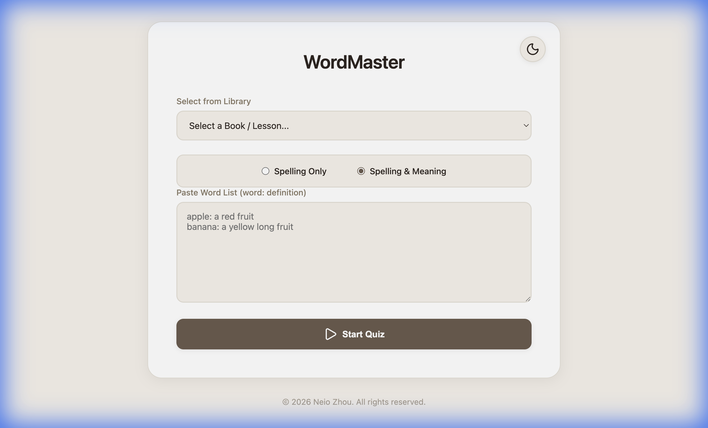

# WordMaster

**WordMaster** is a modern, interactive web application designed to help users master vocabulary through spelling, pronunciation, and meaning verification. It provides a clean, distraction-free interface for practicing word lists, specifically tailored for students using curriculums like *Wordly Wise* and *Vocabulary from Classical Roots*.



## Features

- **📚 Integrated Library**: Comes pre-loaded with:
  - *Vocabulary from Classical Roots - Book E* (Lessons 1-16)
  - *Purposeful Design Spelling Plus - Grade 3*
  - *Wordly Wise* (Sample Lessons)
- **⚡️ One-Shot Verification**: Fast-paced quiz flow. Type your spelling and verify instantly.
- **⚙️ New Quiz Modes**: Choose between **Spelling Only** (hidden meaning) or **Spelling & Meaning** (both inputs visible).
- **🗣️ Pronunciation**: Uses the Web Speech API to pronounce words automatically or on demand.
- **✨ Smart Import**: Paste your own word lists in simple `word: definition` format.
- **📊 Real-time Stats**: Track your correct and incorrect answers as you go.
- **🎨 Premium UI**: Glassmorphism design with dark mode and smooth transitions.

## Tech Stack

- **HTML5 & CSS3**: Vanilla implementation for semantic structure and modern styling.
- **JavaScript (ES Modules)**: Modular architecture without complex build steps.
- **Lucide Icons**: Beautiful, consistent iconography.

## Getting Started

Since WordMaster uses ES Modules, it requires a local server to run (it cannot be run directly via `file://`).

### Prerequisites

- A modern web browser (Chrome, Safari, Edge, Firefox).
- **No backend required**: This is a static site. You just need a web server to serve the files.
- Options for local running: `Node.js`, `Python`, or a VS Code extension like "Live Server".

### Installation & Running

1. **Clone the repository**:
   ```bash
   git clone https://github.com/Neio/wordmaster.git
   cd wordmaster
   ```

2. **Start a local server**:
   
   Using Node.js (Recommended):
   ```bash
   npx serve .
   ```

   Alternatively, using Python:
   ```bash
   python3 -m http.server 8000
   ```

3. **Open in Browser**:
   Navigate to `http://localhost:8000`

## Deployment

This is a static site, so it's perfect for **GitHub Pages**!

1. Push your code to GitHub.
2. Go to your repository **Settings** -> **Pages**.
3. Under **Source**, select `Deploy from a branch`.
4. Select `main` (or `master`) branch and `/ (root)` folder.
5. Click **Save**.

Your app will be live at `https://neio.github.io/wordmaster/` in a few moments!

## Custom Word Lists

You can paste your own lists directly into the text area using the following format:

```text
apple: A round fruit with red or green skin
abstruse: Difficult to understand; complex
veracity: Conformity to facts; accuracy
```

## License

This project is licensed under the MIT License - see the [LICENSE.md](LICENSE.md) file for details.
